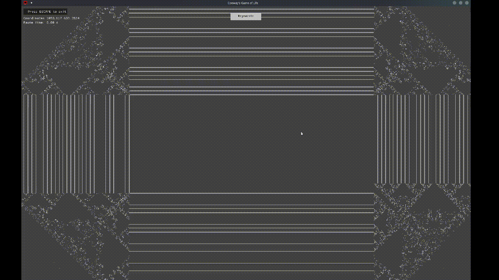

# Conway's Game of Life (poorly implemented)

**Conway's Game of Life** is a cellular simulation that evolves within a discrete universe with a 2D infinite grid of cells and a time that works by generations.
The state of the grid changes at each generation according to a set of rules that each cell follows.
Each cell can either be alive or dead.  
<br>
<u>The following rules are applied to each cell to determine its state in the next generation</u> :
* Any **live cell** with *fewer than two live neighbors* **dies** (underpopulation).
* Any **live cell** with *more than three live neighbors* **dies** (overpopulation).
* Any **live cell** with *two or three live neighbors* **lives** on to the next generation.
* Any **dead cell** with *exactly three live neighbors* **becomes a live cell** (reproduction).
<br>

This project is a simple implementation of this "game" using Rust and the macroquad crate.  
It works by generating a rectangular area in which each cell is randomly set to be alive or dead according to a given probability (density parameter).


## Build :                                                                        
                                                                                  
```                                                                               
cargo build -r                                                                    
cp target/release/GOL .                                                           
```

## Run : 

*Syntax :*
`./GOL [ args... ]`

*Options :*
* `--density <float>` : The density of the generated world (between 0 and 1, default: 0.5)
* `--height <int>` : The height of the generated world (default: 1000)
* `--width <int>` : The width of the generated world (default: 1000)
* `-f, --fullscreen` : Fullscreen mode
* `--pausetime <float>` :  Pause time between each generation in seconds ; 0.25 by default
* `--paused` : Start in paused mode
* `-h` : Show this help message and exit

*Examples :*  
* `./GOL`
* `./GOL --density 0.5 --height 1500 --width 1500`
* `cargo run`
* `cargo run -r  -- --density 0.6 --height 1000 --width 1600`


## Controls :
*  `Mouse Pressed + Drag` : Move in the world
* `Mouse Scroll` : Zoom in/out
* `Left Ctrl + Mouse Scroll` : Change the speed of the simulation
* `Space` : Pause/Unpause the simulation
* `Esc` : Exit the simulation
* `R` : Regenerate the grid of cells according to the set density


# Extras :
*You can do some pretty cool things by playing with the density and the size of the generated area :*  

* With `--density 0.999`
    
      
    <br>
  
* With `--density 1.0 --height 1000 --width 1000` if you want to create a perfect symetrical square 
    
    <br>