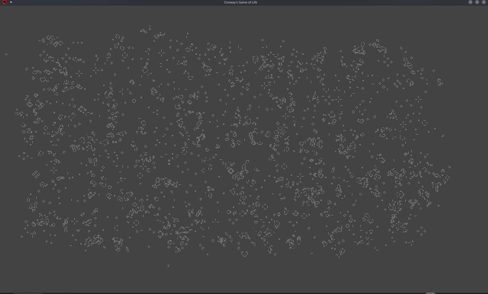

# Conway's Game of Life (poorly implemented)




## Build :                                                                        
                                                                                  
```                                                                               
cargo build -r                                                                    
cp target/release/GOL .                                                           
```

## Run : 

*Syntax :*
`./GOL [density: 0.0 to 1.0] [height: 1000.0 by default] [width: 2000.0 by default]`

*Examples :*  
*   `./GOL 0.5 2000.0 5000.0`
*  `cargo run`


## Controls :
*  `Mouse Pressed + Drag` : Move in the world
* `Mouse Scroll` : Zoom in/out
* `Left Ctrl + Mouse Scroll` : Change the speed of the simulation